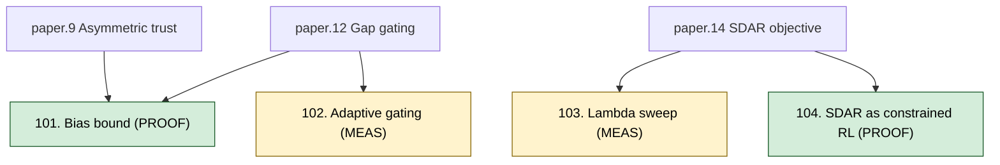

# SDAR improvements concept graph

Four improvement concepts split across two modes:
- **PROOFS** (101, 104) — formal mathematical extensions, fully written in `proofs/`.
- **MEASUREMENTS** (102, 103) — sandbox experiments measured by Agent C's scripts.

## Validation modes

| ID  | Mode        | Validation file                                      |
|-----|-------------|------------------------------------------------------|
| 101 | PROOF       | `proofs/gating-bias-bound.tex`                       |
| 102 | MEASUREMENT | `improvements/adaptive-gate.py` (sandbox)            |
| 103 | MEASUREMENT | `improvements/lambda-sweep.py` (sandbox)             |
| 104 | PROOF       | `proofs/sdar-as-constrained-rl.tex`                  |
