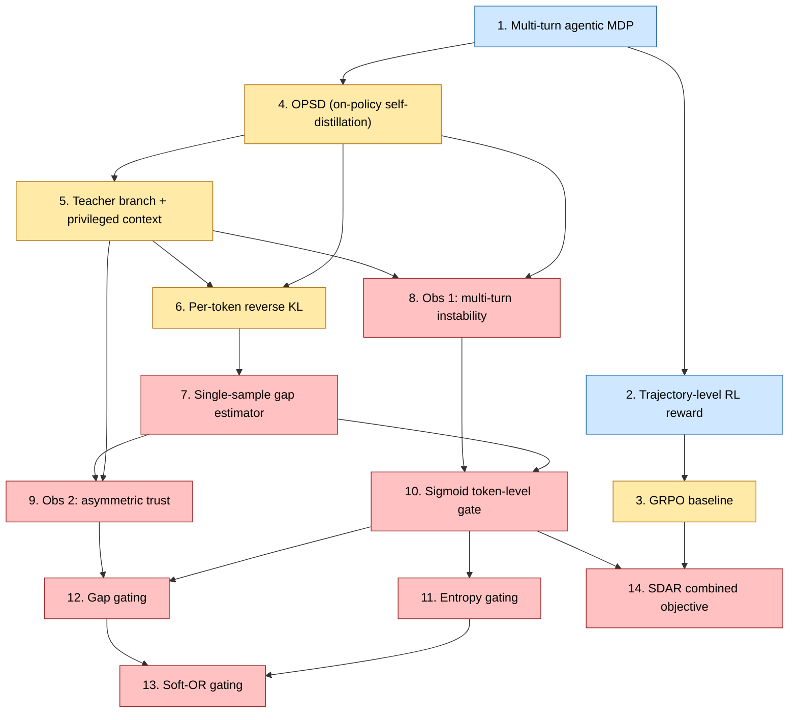

# SDAR paper concept graph

The 14 concepts that constitute the SDAR paper's mathematical core, in a directed-acyclic dependency graph.

## Color legend

- Blue (intro) — accessible from a working knowledge of LLM training.
- Yellow (intermediate) — needs background in policy-gradient RL and KL divergences (Chain Ch 28-31).
- Red (advanced) — paper-specific contributions; the gating mechanism + asymmetric-trust analysis.

## Suggested reading paths

- **Speed run (1 hr):** 1 → 2 → 3 → 4 → 7 → 10 → 12 → 14.
- **Full chain (3-4 hr):** depth-first along edges, in numerical order.
- **Math focus:** 6 → 7 → 9 → 10 → 12 then jump to `proofs/gating-bias-bound.tex`.
